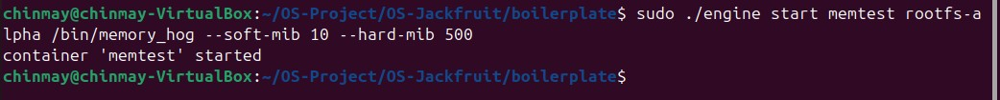
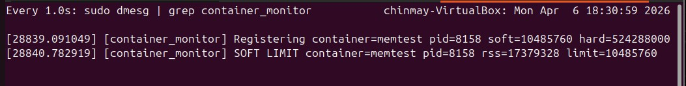

# OS Jackfruit – Lightweight Container Runtime in C

---

## Team Members

| SRN | Name |
|-----|------|
| PES2UG24AM047 | Chinmay N S |
| PES2UG24AM036 | Ayush Gaikwad |

---

## Project Overview

OS Jackfruit is a lightweight Linux container runtime built from scratch in C. The idea was to understand how tools like Docker work under the hood by actually implementing the core pieces ourselves — process isolation, logging, IPC, and memory enforcement.

Each "container" in this project is a Linux process created using `clone()` with namespace flags (`CLONE_NEWPID`, `CLONE_NEWUTS`, `CLONE_NEWNS`). This gives the process its own isolated PID tree, hostname, and filesystem view. The container is then `chroot`'d into a minimal root filesystem so it cannot see the host's directories.

Alongside the user-space runtime, we built a Linux Kernel Module (`monitor.c`) that tracks container PIDs, polls their RSS (Resident Set Size) every second, logs a warning when memory crosses a soft threshold, and sends `SIGKILL` when the hard limit is exceeded.

The entire project runs on Ubuntu 24.04 inside VirtualBox.

---

## Features Implemented

- **Process Isolation** — Containers run with separate PID, UTS, and mount namespaces using `clone()` with appropriate flags. Each container gets its own hostname and filesystem root via `chroot`.
- **Container Lifecycle Management** — Full CLI support: `start`, `run`, `stop`, `ps`, and `logs`. The supervisor process stays alive and tracks metadata (PID, state, start time, memory limits) for every container.
- **IPC via UNIX Domain Socket** — The CLI client and the supervisor communicate over a UNIX domain socket at `/tmp/mini_runtime.sock`. The CLI sends a command, the supervisor processes it and sends back a response — two completely separate processes, clean bidirectional IPC.
- **Bounded-Buffer Logging** — Container stdout/stderr is captured through pipes into a shared ring buffer. A producer thread reads from the pipe and pushes log entries; a consumer thread pops entries and writes them to per-container log files. Synchronised with mutex and condition variables to avoid race conditions and dropped data.
- **Kernel Memory Monitoring** — A kernel module exposes `/dev/container_monitor`. The supervisor registers container PIDs via `ioctl`. A kernel timer fires every second, checks RSS for each tracked process, and acts on limit violations.
- **Soft Limit Warning** — When a container's RSS first crosses the soft threshold, the kernel module logs a `SOFT LIMIT` warning via `printk`. This is a one-time advisory warning per container — the process keeps running.
- **Hard Limit Enforcement** — When RSS exceeds the hard limit, the kernel module sends `SIGKILL` to the container process and logs a `HARD LIMIT` event. The supervisor detects the child's death via `SIGCHLD` and marks the container state as `killed`.
- **Scheduler Experiments with `nice` Values** — Containers can be started with a `--nice` flag. We ran two cpu_hog containers simultaneously with different nice values and observed how Linux CFS scheduling affected their CPU allocation and progress rate.

---

## Prerequisites

- Ubuntu 22.04 or 24.04 running inside VirtualBox (WSL will not work — kernel modules cannot be loaded there)
- Secure Boot must be **OFF** in VirtualBox VM settings (Settings → System → Motherboard → uncheck Enable EFI)
- GCC with static linking support
- `make` utility
- Linux kernel headers matching the running kernel
- Root / sudo access

Install dependencies:

```bash
sudo apt update
sudo apt install -y build-essential linux-headers-$(uname -r) git wget
```

---

## Setup and Build Instructions

All commands below assume you are inside the `boilerplate` directory:

```bash
cd ~/OS-Project/OS-Jackfruit/boilerplate
```

### Step 1 — Build the engine and kernel module

```bash
make all
```

### Step 2 — Recompile workload binaries as static

```bash
gcc -static -o memory_hog memory_hog.c
gcc -static -o cpu_hog    cpu_hog.c
gcc -static -o io_pulse   io_pulse.c
```

Verify they are statically linked:

```bash
file memory_hog cpu_hog io_pulse
```

### Step 3 — Create per-container rootfs copies

```bash
cp -a rootfs rootfs-alpha
cp -a rootfs rootfs-beta
```

### Step 4 — Copy workload binaries into rootfs copies

```bash
cp memory_hog cpu_hog io_pulse rootfs-alpha/bin/
cp memory_hog cpu_hog io_pulse rootfs-beta/bin/
```

### Step 5 — Ensure `/proc` directories exist

```bash
mkdir -p rootfs-alpha/proc
mkdir -p rootfs-beta/proc
```

### Step 6 — Test that binaries work inside the rootfs

```bash
sudo chroot rootfs-alpha /bin/memory_hog
```

### Step 7 — Load the kernel module

```bash
sudo insmod monitor.ko
lsmod | grep monitor
ls /dev/container_monitor
```

### Step 8 — Start the supervisor

```bash
sudo ./engine supervisor rootfs
```

Expected output: `[supervisor] ready on /tmp/mini_runtime.sock`

---

## Screenshots and Explanations

### Screenshot 1 — Supervisor Running

**Command:**
```bash
sudo ./engine supervisor rootfs
```

The supervisor process starts and binds to the UNIX domain socket at `/tmp/mini_runtime.sock`. This is the central daemon that all CLI commands communicate with. It stays alive for the entire session, accepting commands, launching containers, and tracking their state.


---

### Screenshot 2 — Container Execution and Logging (`engine run` + `engine logs`)

**Commands:**
```bash
sudo ./engine run t2 rootfs "/bin/echo HELLO_WORLD"
sudo ./engine logs t2
```

This shows the full container lifecycle. The `run` command launches container `t2`, executes `/bin/echo HELLO_WORLD` inside the isolated chroot environment, waits for it to finish, and returns. The `logs` command retrieves the captured output from the per-container log file, confirming the logging pipeline works end to end.


---

### Screenshot 3 — Kernel Module Interaction (`dmesg`)

**Command:**
```bash
sudo dmesg | tail
```

The dmesg output shows repeated register/unregister pairs for containers `t1` and `t2`. Each pair represents one complete container run — registered at launch, unregistered on exit. This confirms that the user-space supervisor and the kernel module are communicating correctly through the `ioctl` interface.


---

### Screenshot 4 — CLI and IPC (`engine start` via UNIX socket)

**Commands:**
```bash
sudo ./engine start alpha rootfs-alpha /bin/cpu_hog --soft-mib 40 --hard-mib 64
sudo ./engine start beta  rootfs-beta  /bin/cpu_hog --soft-mib 40 --hard-mib 64 --nice 10
```

This demonstrates the IPC control channel. When `engine start` is invoked it connects to `/tmp/mini_runtime.sock`, sends the request to the supervisor, which calls `clone()` with `CLONE_NEWPID | CLONE_NEWUTS | CLONE_NEWNS`, chroots into the specified rootfs, and sends back confirmation. Two containers now run concurrently, each isolated in their own namespace.


---

### Screenshot 5 — Soft Limit Warning

**Commands:**
```bash
sudo ./engine start memtest rootfs-alpha /bin/memory_hog --soft-mib 10 --hard-mib 500
watch -n1 "sudo dmesg | grep container_monitor"
```

The `memory_hog` program allocates memory in 8 MB chunks per second. With a soft limit of 10 MiB it crosses the threshold within the first two seconds. The kernel timer fires, detects the RSS violation, logs a `SOFT LIMIT` warning, and sets an internal flag so the warning only fires once. The container keeps running — soft limits are advisory only.





---

### Screenshot 6 — Hard Limit Enforcement (dmesg + `engine ps`)

**Commands:**
```bash
sudo ./engine start memtest rootfs-alpha /bin/memory_hog --soft-mib 10 --hard-mib 50
watch -n1 "sudo dmesg | grep container_monitor | tail -20"
sudo ./engine ps
```

When RSS exceeded the 50 MiB hard limit, the kernel module called `send_sig(SIGKILL, task, 1)`. The supervisor's `SIGCHLD` handler detected the death via `WIFSIGNALED` and marked the container state as `killed` — distinguishing a forced termination from a clean exit.


---

### Screenshot 7 — Scheduling Experiment (nice values)

**Commands:**
```bash
sudo ./engine start hi rootfs-alpha /bin/cpu_hog --soft-mib 40 --hard-mib 64 --nice -5
sudo ./engine start lo rootfs-beta  /bin/cpu_hog --soft-mib 40 --hard-mib 64 --nice 15
sudo ./engine logs hi
sudo ./engine logs lo
```

Both containers run the same `cpu_hog` binary. `hi` (nice -5) logs elapsed=1 through elapsed=7 and beyond, while `lo` (nice 15) barely reaches elapsed=1 before the log is read. Linux CFS assigns higher scheduling weight to lower nice values, so `hi` gets CPU far more frequently and makes faster progress.


---

### Screenshot 8 — Clean Teardown

**Commands:**
```bash
ps aux | grep defunct
sudo rmmod monitor
sudo dmesg | grep container_monitor | tail -5
```

After Ctrl+C on the supervisor, `ps aux | grep defunct` shows no zombie processes — the `SIGCHLD` handler correctly reaped all children. `rmmod monitor` unloads cleanly with no kernel memory leaks. The final dmesg line reads `Module unloaded.` confirming full cleanup of all resources.


---

## Conclusion

This project gave us a practical, ground-level understanding of how containerisation actually works. We implemented process isolation using Linux namespaces, built a working IPC pipeline with UNIX sockets and pipes, wrote a kernel module that enforces memory policies, and demonstrated real scheduling differences using CFS nice values.

The core OS concepts we worked with directly: `clone()` and namespace isolation, `chroot` and filesystem virtualisation, producer-consumer synchronisation with mutex and condition variables, kernel-userspace communication via `ioctl`, `SIGCHLD` handling and zombie prevention, RSS-based memory monitoring from kernel space, and CPU scheduling weight through nice values.

Building it from scratch made it clear how much of what Docker and similar tools do is simply these Linux primitives composed carefully.
